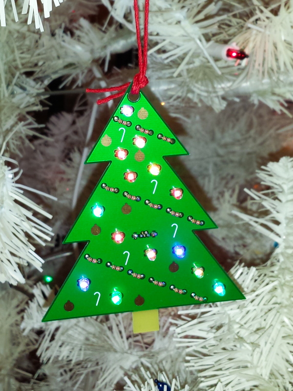
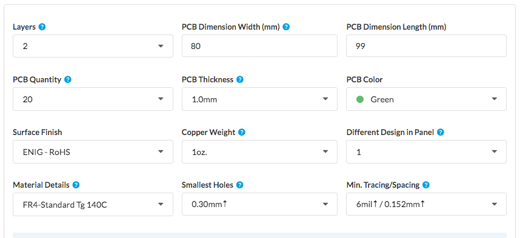

This repository contains the [KiCad][1] and [Gerber][2] files for a
PCB Christmas ornament shaped like a Christmas tree.

The little tree has candy canes on the silkscreen, ornaments made out
of exposed copper, and a trunk made out of exposed FR4.  The garland
is made out of resistors, and the lights are LEDs, powered by a micro
USB connector on the back.

You can hang the ornament on your tree by putting a string through the
hole at the top of the ornament.  Or, you can use it as a standalone
decoration, in which case the USB cable in the back acts as a sort of
"[kickstand](kickstand.jpg)" to hold the tree up.

This README should contain enough information to build the ornament.
However, if you want more detailed, step-by-step instructions with
pictures, I've also written
[an Instructable on how to build the ornament][17].

## Bill of Materials

* USB Micro B connector, qty 1.  Würth part number 614105150721.
  Digi-Key part number [732-5958-1-ND][3].

* 1/8 watt resistors, qty 14.  Make sure the length of the resistor is
  around 3.3-3.6 mm.  The minimum resistor value you should use is 150
  Ohms.  However, I found that to be too bright, so I eventually
  settled on 1k Ohm resistors.  Especially if you use different LEDs
  than I did, you should experiment to see what resistor value gives
  you a brightness that you like.  For 1k Ohm resistors: Stackpole
  part number CF18JT1K00.  Digi-Key part number [CF18JT1K00CT-ND][4].

* 3mm LEDs, qty 14.  Just about any 3mm LED should do, but I used
  color-changing LEDs to [add a bit of motion][13] to the ornament.
  When soldering the LEDs, make sure the short leg of the LED goes
  into the square pad, and the long leg of the LED goes into the round
  pad.  For color-changing LEDs: SparkFun part number [COM-11448][5].
  Digi-Key part number [1568-1196-ND][6].

* Optional: 3.3µF 0805 ceramic capacitor, qty 3.  These probably
  aren't essential, but since decoupling capacitors are considered to
  be a good idea, I added pads for three capacitors on the back of the
  board.  (Though if you're using ordinary LEDs, you really don't need
  them, since the current will be constant.  I only added them because
  I'm using color-change LEDs, which probably use PWM to fade through
  the colors.)  Unlike all the other components, these are
  surface-mount, so they're a little trickier to solder.  It helps if
  you have a second person to hold the capacitor in place with
  tweezers.  Samsung part number CL21A335KPFNNNG.  Digi-Key part
  number [1276-6461-1-ND][7].

* Optional: string to hang the ornament.  Just about any string should
  do.  I used [Hemptique red cord][8].

And, of course, you'll also need a USB charger and Micro B USB cable
to power the ornament.

## Circuit board

Most fabs should work fine, although you'll probably want a fab that
offers green soldermask.  (That rules out OSH Park, unless you want
purple trees!)  I went with [EasyEDA][9] because they are inexpensive
and offer green soldermask.  (However, it appears that EasyEDA is
spinning off their circuit board manufacturing to the site
[JLCPCB][18].)

I went with a PCB thickness of 1.0mm, because that's what
[the datasheet for the USB connector][10] recommends.  (With a thicker
PCB, the pins of the USB connector won't protrude all the way through
the board.)  I chose the more expensive [ENIG][11] finish, because I
thought that would look better on the exposed-copper ornaments.

If you're not making any changes to the board, all you need to do is
zip up the files in the `gerber` directory, and upload the zipfile to
EasyEDA.  After uploading the zipfile, these are the options I chose
on the EasyEDA site:

Note that in the KiCad files and Gerber files, the "front" of the
board is actually the back, and vice-versa.  This is because EasyEDA
adds a customer ID number to the front of the board, but I wanted the
number to be on the actual back of the board, where it doesn't disrupt
the esthetics of the ornament.

I recommend ordering more boards than you need, because some of the
boards will have cosmetic defects.  (They still work fine
electrically, but just don't make an ornament that looks as nice.)  In
particular, the FR4 appears to have some red writing on it in places,
so every now and then that will show up in the trunk of a tree.

Another way to solve the problem of the red writing on the FR4 is to
paint the trunk.  (e. g. with flat brown [Testors enamel paint][16])

## License

This design is licensed under the
[Creative Commons Attribution-ShareAlike 4.0 International license][12].

Some of the footprints in `myLibrary.pretty` are based on footprints
in the [KiCad library][14], which is licensed under the
[KiCad library license][15] (which is now also CC-BY-SA-4.0, with an
exception).

[1]: http://kicad-pcb.org/
[2]: https://en.wikipedia.org/wiki/Gerber_format
[3]: https://www.digikey.com/products/en?keywords=732-5958-1-ND
[4]: https://www.digikey.com/products/en?keywords=CF18JT1K00CT-ND
[5]: https://www.sparkfun.com/products/11448
[6]: https://www.digikey.com/products/en?keywords=1568-1196-ND
[7]: https://www.digikey.com/products/en?keywords=1276-6461-1-ND
[8]: https://smile.amazon.com/gp/product/B007IT72JS/
[9]: https://easyeda.com/order
[10]: http://katalog.we-online.de/em/datasheet/614105150721.pdf
[11]: https://en.wikipedia.org/wiki/Electroless_nickel_immersion_gold
[12]: https://creativecommons.org/licenses/by-sa/4.0/
[13]: https://www.flickr.com/photos/107479024@N04/26884440769/
[14]: https://github.com/KiCad/kicad-footprints
[15]: https://forum.kicad.info/t/kicad-library-licensing/7856
[16]: https://www.testors.com/product-catalog/testors-brands/testors/enamel-paint/enamel-paints
[17]: http://www.instructables.com/id/LED-Circuit-Board-Christmas-Tree-Ornament/
[18]: https://jlcpcb.com/quote
